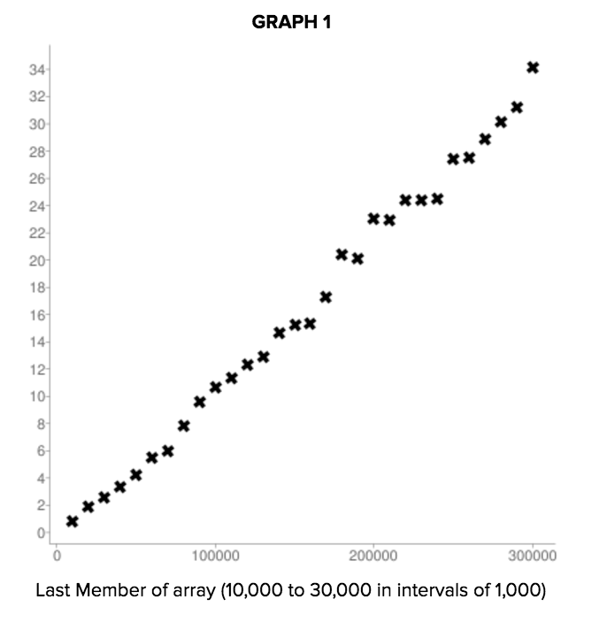
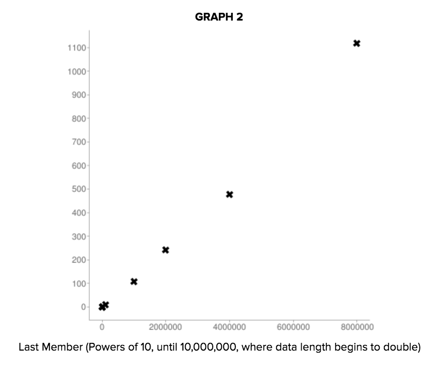
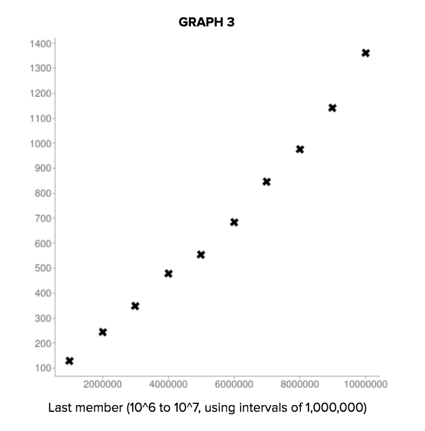
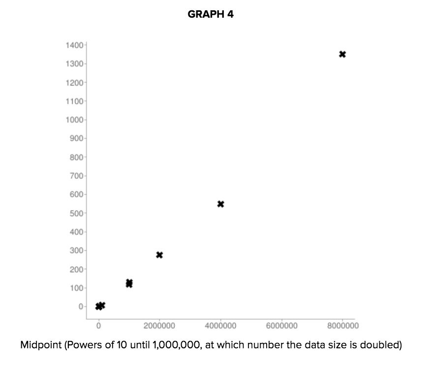
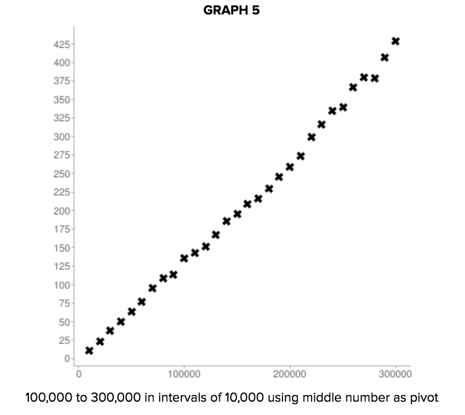
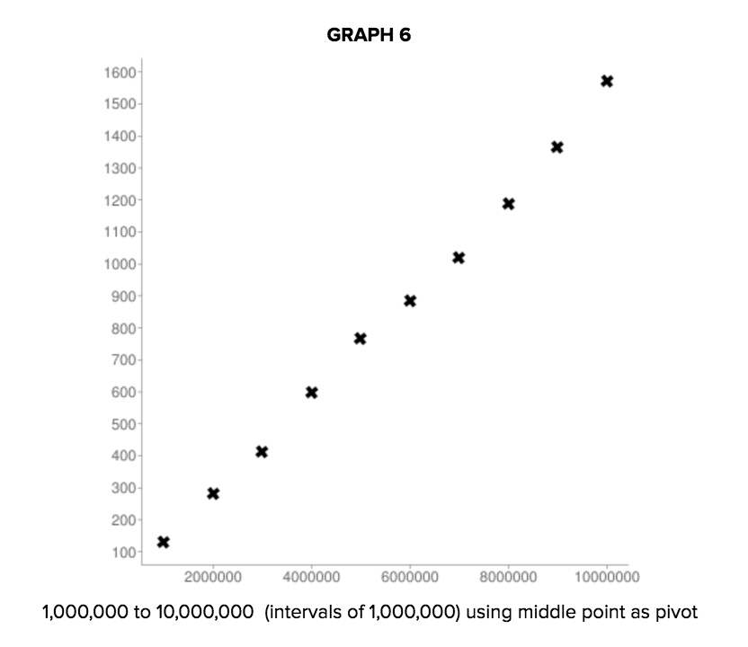
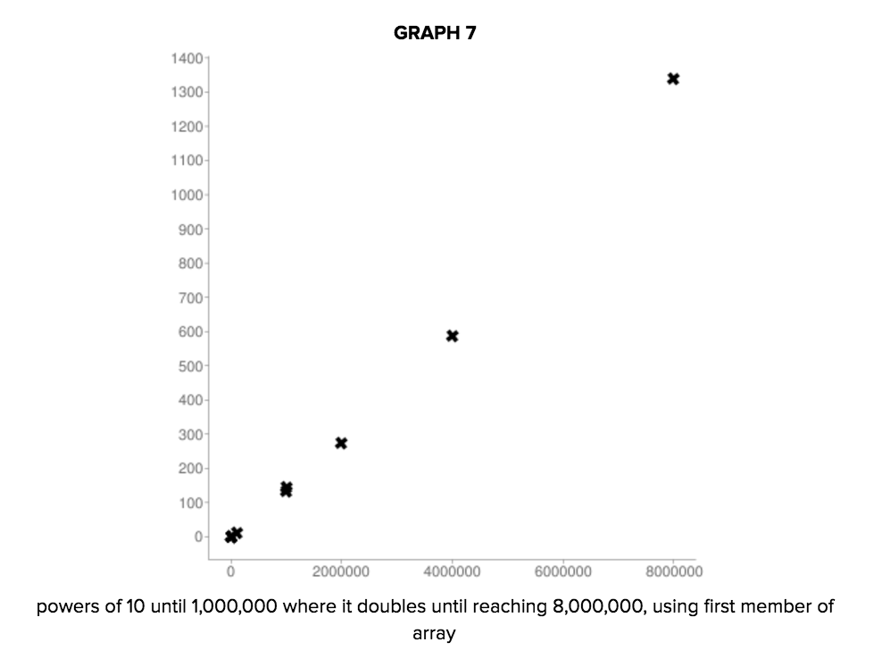
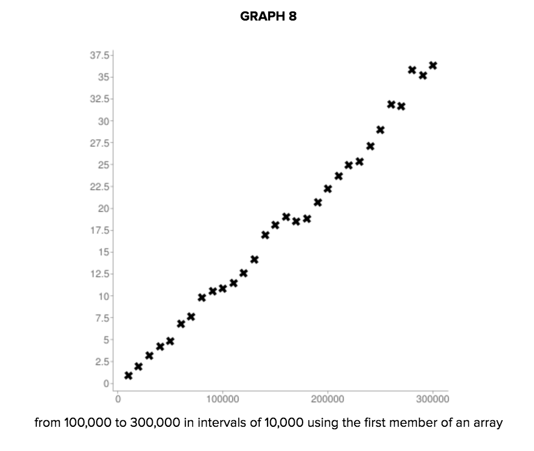
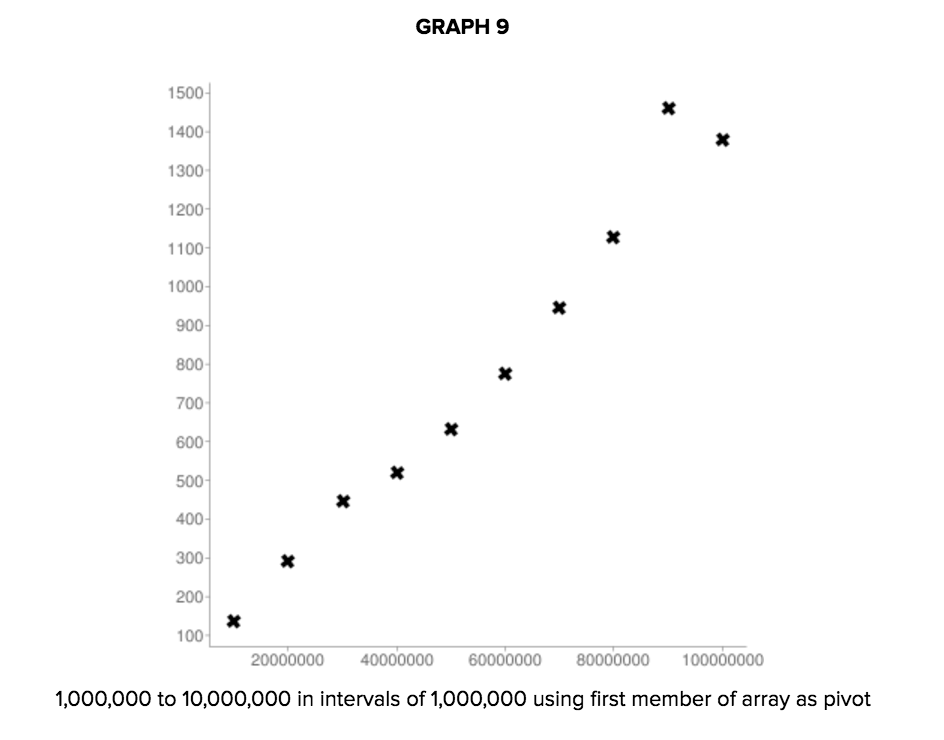

# AppleJuice

 Kevin Li, Pacy Yan, Alitquan Mallick 

<h2> QUICK SORT ALGORITHM: </h2>

 QSort(arr): Uses a partition to separate numbers less than or greater than a given value in the array, and then recurses the process on the subarrays to the left and right of the partition, until the subarrays no longer need to be sorted, and all values are guaranteed to be in sorted order 

<h2> HOW TO RUN IT: </h2>
<ol> 
<li> Clone the repository </li>
<li> In terminal, run <code>javac QuickSortSortTester.java</code> </li>
<li> run <code>java QuickSortTester</code> for each time you would like to have a trial</li>
</ol>

<h2> BIG OH HYPOTHESIS: </h2>
<h3> Best Case </h3>

 The best pivot choice is if it always results in spliting the subarray in half, which guarantees that all of the subarrays are made equally as short as possible. I think that the runtime would be nlogn. 

<h3> Average/Most Likely Case </h3>
<h3> Worst Case </h3>

 The worst pivot choice would be a number that is always at either the extreme high or extreme low end of the array, which means that the next recursed partition is only reduced in size by one number. This would be a n * n runtime. 

<h2> METHODOLOGY: </h2>

<h2> DATA AND ANALYSIS: </h2>

  

This graph appears to depict a linear runtime and the concentration of the points seem mostly even in all the areas. That means that as the array becomes bigger, the runtime (if the pivot choice were the last member of the array) would become larger as well. Since the line of best fit intuitively seems straight, one would could conclude that the runtime is linear if the pivot choice were the last member. However, graphs of larger arrays show otherwise. 

This graph is exponential and is a better analysis of the data because it gives a larger array range. Now we know that the runtime of QuickSort with the pivot choice at the end of the array. As the array size increases, the runtime grows expontentially. 

 

This graph can be analyzed in the same way Graph 2 was. It uses a larger array range and thus is a more accurate representation of the change in runtime of the of array if the pivot choice was at the end. 

 

This graph appears slightly exponential with the last point. From this we could conclude that starting the pivot choice at the midpoint leads to an exponential runtime, where the size of the array correlates exponentially with the runtime. However, analysis of later graphs prove otherwise. 

 

This graph shows a linear runtime. If you were to draw a line of best fit, it would be a constant runtime for each growth in array size. This proves that the runtime of Quicksort wit the midpoint as the pivot choice is constant or linear. 

 

This graph reaches the same conclusion as Graph 5, just with a bigger range of array sizes. The conclusion is the same; the runtime of QuickSort when the pivot choice is the midpoint is linear.

 

This graph appears linear for the most part and seems exponential because of the last point. However, because the data is so sparse, it is hard to tell if that is an outlier case, the graph is actually exponential, or if it is actually linear. From this, we could conclude that starting the pivote choice at the beginning leads to an exponential runtime, where the size of the array correlates exponentially with the runtime. However, later graphs disprove this. 

 

This graph is linear and shows that the QuickSort runtime with the midpoint as the pivot choice is constant or linear, such that the size of the array correlates linearly with the runtime. 

 

 

The same analysis given to graph 8 could be said except this graph is more accurate as it has a larger array range.  

 

<h4> Runtimes for pivot point at last member of array </h4>
Data set in powers of ten:  

Data in formation (ARR LENGTH, RUNTIME)
(1, 7.60000036098063E-4 )  
(10, 0.0053599999658763406 ) 
(100, 0.09247999995946884 ) 
(1000, 0.3441999977827072 ) 
(10000, 1.00900000333786 ) 
(100000, 8.70044002532959 ) 
(1000000, 108.21656036376953 ) 
(1000000, 122.93615936279296 ) 
(2000000, 241.4168798828125 ) 
(4000000, 477.8561999511719 ) 
(8000000, 1117.9667700195312 ) 

Data in formation (ARR LENGTH, RUNTIME) 
Created by Alitquan Mallick 
(10000, 0.8294400000572204 )  
(20000, 1.843919997215271 ) 
(30000, 2.537760000228882 ) 
(40000, 3.329759998321533 ) 
(50000, 4.2776000022888185 ) 
(60000, 5.523719940185547 ) 
(70000, 5.979760017395019 ) 
(80000, 7.807799968719483 ) 
(90000, 9.581319980621338 ) 
(100000, 10.631719970703125 ) 
(110000, 11.320760040283202 ) 
(120000, 12.365920066833496 ) 
(130000, 12.89851993560791 ) 
(140000, 14.656359977722168 ) 
(150000, 15.232840003967285 ) 
(160000, 15.373320007324219 ) 
(170000, 17.297759895324706 ) 
(180000, 20.384360122680665 ) 
(190000, 20.102360076904297 ) 
(200000, 23.053879852294923 ) 
(210000, 22.945480194091797 ) 
(220000, 24.38431999206543 ) 
(230000, 24.36103988647461 ) 
(240000, 24.450120010375976 ) 
(250000, 27.42287986755371 ) 
(260000, 27.544720153808594 ) 
(270000, 28.833719940185546 ) 
(280000, 30.188360061645508 ) 
(290000, 31.196840133666992 ) 
(300000, 34.13496017456055 ) 

Data in formation (ARR LENGTH, RUNTIME) 
Created by Alitquan Mallick 
(1000000, 129.23768005371093 ) 
(2000000, 245.56231994628905 ) 
(3000000, 349.6306408691406 ) 
(4000000, 476.635078125 ) 
(5000000, 653.7181982421876 ) 
(6000000, 784.3321557617187 ) 
(7000000, 987.5581127929687 ) 
(8000000, 1176.401025390625 ) 
(9000000, 1142.6854443359375 ) 
(10000000, 1360.9269970703126 ) 

<h4> Runtimes for pivot point at midpoint  of array</h4>
Data set in powers of ten: 

Data in formation (ARR LENGTH, RUNTIME) 
(1, 3.600000170990825E-4 ) 
(10, 6.800000322982669E-4 ) 
(100, 0.004999999925494194 ) 
(1000, 0.05971999928355217 ) 
(10000, 0.7310799932479859 ) 
(100000, 9.463199882507324 ) 
(1000000, 116.38608154296875 ) 
(1000000, 130.77955871582031 ) 
(2000000, 277.97167907714845 ) 
(4000000, 612.6696337890625 ) 
(8000000, 1250.0573193359376 ) 

Data in formation (ARR LENGTH, RUNTIME) 
Created by Alitquan Mallick 
(10000, 11.157800064086913 ) 
(20000, 23.10468017578125 ) 
(30000, 38.25751983642578 ) 
(40000, 50.73571960449219 ) 
(50000, 63.16936050415039 ) 
(60000, 77.58707977294922 ) 
(70000, 95.86880035400391 ) 
(80000, 109.03892028808593 ) 
(90000, 113.40452087402343 ) 
(100000, 135.89312072753907 ) 
(110000, 142.91648010253905 ) 
(120000, 151.68772033691405 ) 
(130000, 167.8890802001953 ) 
(140000, 185.99247985839844 ) 
(150000, 195.51151977539064 ) 
(160000, 208.72547790527344 ) 
(170000, 216.78172058105469 ) 
(180000, 230.15296264648438 ) 
(190000, 245.97256103515625 ) 
(200000, 258.6759210205078 ) 
(210000, 273.691640625 ) 
(220000, 299.19716796875 ) 
(230000, 316.4150048828125 ) 
(240000, 334.21783935546875 ) 
(250000, 339.25795776367187 ) 
(260000, 366.86240234375 ) 
(270000, 380.1865600585937 ) 
(280000, 378.8865600585938 ) 
(290000, 406.751240234375 ) 
(300000, 428.6623217773438 ) 

Data in formation (ARR LENGTH, RUNTIME) 
Created by Alitquan Mallick 
(1000000, 130.65179962158203 ) 
(2000000, 279.9392785644531 ) 
(3000000, 414.04395874023436 ) 
(4000000, 597.26416015625 ) 
(5000000, 767.25732421875 ) 
(6000000, 883.1020068359375 ) 
(7000000, 1019.2953198242187 ) 
(8000000, 1186.3113037109374 ) 
(9000000, 1364.6184716796874 ) 
(10000000, 1571.354443359375 ) 

<h4> Runtimes for pivot point at first member of array</h4>  
Data set in powers of ten: 

Data in formation (ARR LENGTH, RUNTIME) 
(1, 3.600000170990825E-4 ) 
(10, 8.800000417977571E-4 ) 
(100, 0.005679999999701976 ) 
(1000, 0.07995999991893768 ) 
(10000, 0.9126399993896485 ) 
(100000, 12.425439987182617 ) 
(1000000, 143.57108001708986 ) 
(1000000, 130.84804077148436 ) 
(2000000, 274.08636291503905 ) 
(4000000, 588.1803527832031 ) 
(8000000, 1338.5633154296875 ) 

Data in formation (ARR LENGTH, RUNTIME) 
Created by Alitquan Mallick 
(10000, 0.9057600045204163 ) 
(20000, 1.9170800018310548 ) 
(30000, 3.16032000541687 ) 
(40000, 4.246760025024414 ) 
(50000, 4.819080028533936 ) 
(60000, 6.781999988555908 ) 
(70000, 7.643519992828369 ) 
(80000, 9.822439994812012 ) 
(90000, 10.54727996826172 ) 
(100000, 10.883080024719238 ) 
(110000, 11.461079940795898 ) 
(120000, 12.585480079650878 ) 
(130000, 14.110639991760253 ) 
(140000, 16.93756000518799 ) 
(150000, 19.10675994873047 ) 
(160000, 21.061800003051758 ) 
(170000, 18.521920013427735 ) 
(180000, 18.850960083007813 ) 
(190000, 20.721439819335938 ) 
(200000, 22.27416000366211 ) 
(210000, 23.64604019165039 ) 
(220000, 24.919600143432618 ) 
(230000, 25.36819984436035 ) 
(240000, 27.113520050048827 ) 
(250000, 29.017080230712892 ) 
(260000, 31.924079971313475 ) 
(270000, 31.627799758911134 ) 
(280000, 35.80675987243652 ) 
(290000, 35.19712005615234 ) 
(300000, 36.32236022949219 ) 

Data in formation (ARR LENGTH, RUNTIME) 
Created by Alitquan Mallick 
(10000000, 136.9246398925781 ) 
(20000000, 291.86176208496096 ) 
(30000000, 446.40104248046873 ) 
(40000000, 518.47236328125 ) 
(50000000, 633.1504443359376 ) 
(60000000, 776.6074340820312 ) 
(70000000, 943.8649609375 ) 
(80000000, 1128.051484375 ) 
(90000000, 1460.0718701171875 ) 
(100000000, 1377.282841796875 ) 

<h2> How do pivot selection and data arrangements affect execution time? </h2>
